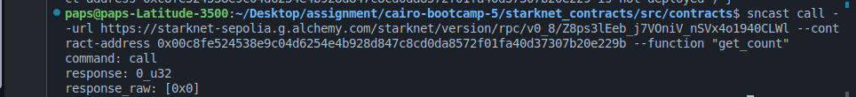
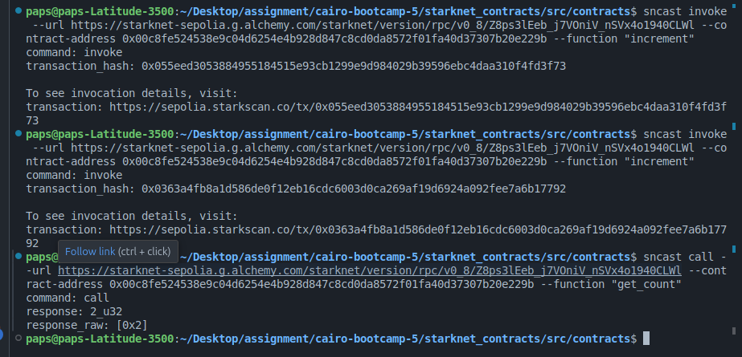
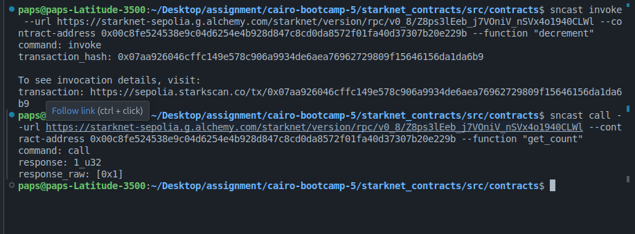

# Session 5b Assignment: sncast Deployment

## First Step:

created an account using below command in my terminal

" sncast create --url <SEPOLIA RPC URL> --name <ACCOUNT NAME> "

## Second Step:

funded the address gotten from the first step:
go to https://starknet-faucet.vercel.app/ to fund your account.

### note :

funding your account is crucial before proceeding to step 3.

## Step three:

Deployed the account using:
sncast deploy --url <SEPOLIA RPC URL> --name <ACCOUNT NAME>

## Step Four:

Deployed my Counter contract:

## Step Five:

Interacted with the Counter contract:

## Tested the get_count function with sncast call

Result :

## Tested increment function with sncast invoke

Result :

## Tested decrement function with sncast invoke

Result :

At the end of the practice i was able to deploy with sncast and testes my functions using call and invoke methods in sncast.
