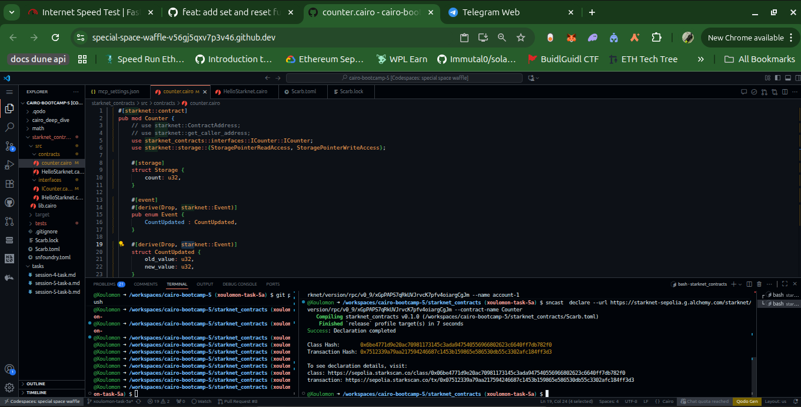
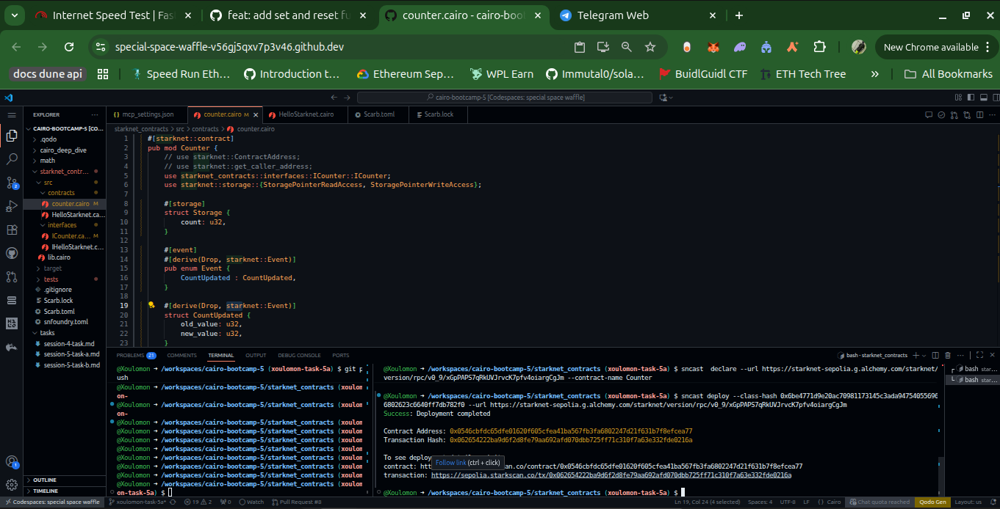
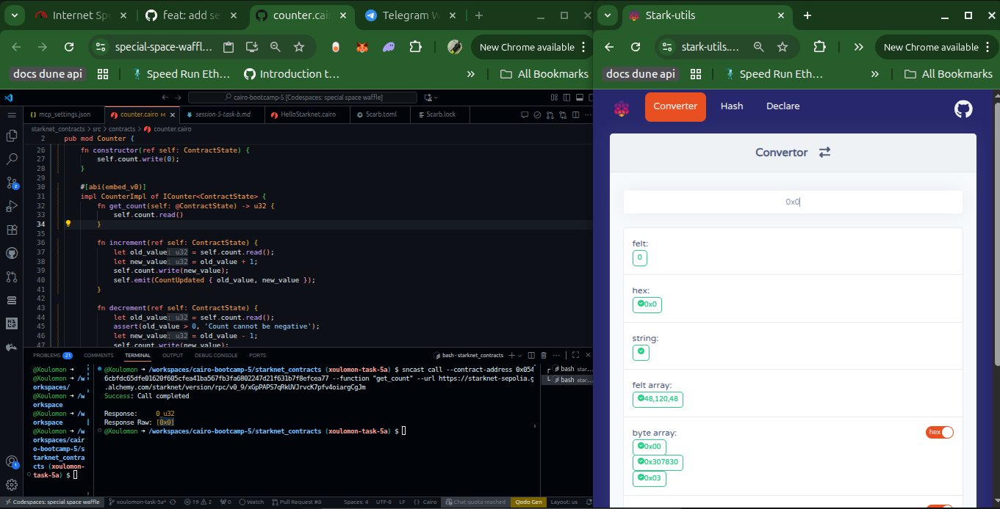
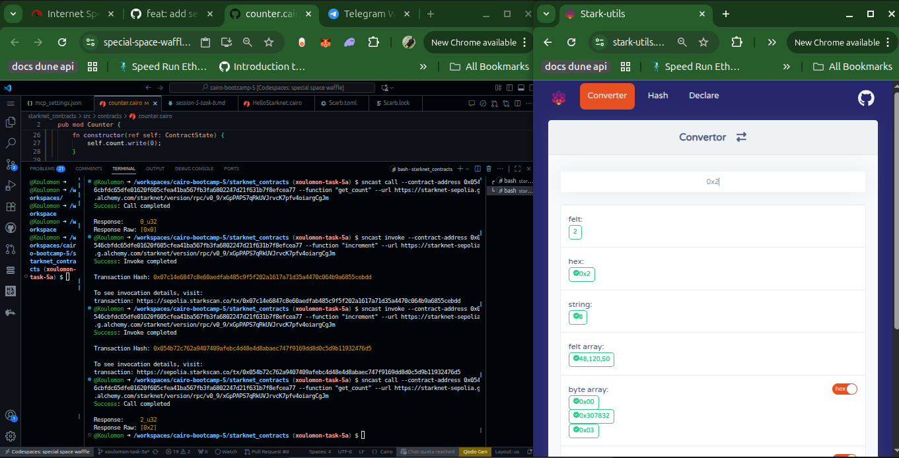
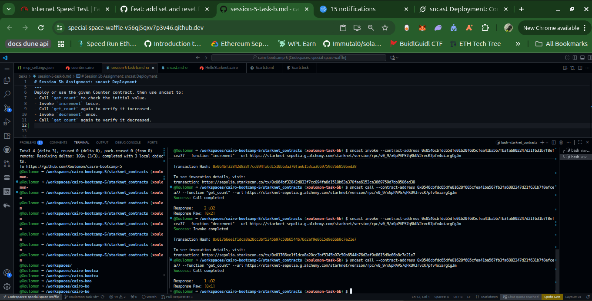

## Overview
The Counter contract is a basic Starknet contract that maintains a single `count` value. It exposes:
- `get_count`: A view function to read the current count.
- `increment`: Increases the count by 1.
- `decrement`: Decreases the count by 1.

In this assignment:
- Deploy (or use an existing deployment of) the Counter contract.
- Use `sncast` to:
  - Query the initial count.
  - Increment the count twice.
  - Verify the updated count.
  - Decrement the count once.
  - Verify the final count.

## Prerequisites
- **Starknet CLI Tools**: Install `sncast` via [Starknet Foundry](https://book.starknet.io/ch02-05-foundry.html#installing-foundry). Ensure it's configured with your Starknet account (e.g., via `starkli account deploy` for an account contract).
- **Cairo Compiler**: Use `scarb` to build the contract.
- **Starknet Network**: This guide assumes deployment to Sepolia testnet. Update RPC URLs and keys as needed.
- **Environment Variables**:
  - `STARKNET_RPC_URL`: Your Starknet RPC endpoint from blast, alchemy, etc.
- **GitHub Repo Setup**: Clone this repo, add your work, and commit changes.

## Step-by-Step Instructions

### 1. Declare and Deploy the Counter Contract
If you haven't deployed the contract yet, follow these steps:

1. Clone the Starknet contracts repo:
   ```bash
   git clone https://github.com/starknet-edu/starknet-contracts.git
   cd starknet-contracts/src/contracts
   ```

2. Build the contract using Scarb:
   ```bash
   sncast declare --contract-name <CONTRACT_NAME> --url <RPC_URL>
   ```

3. Deploy to Starknet Sepolia (replace with your account address and private key):
   ```bash
   sncast contract deploy --url <RPC_URL> --class-hash <CLASS_HASH>
   ```
   
   - Note the **Contract Address** from the output (e.g., `0x...`). Save it for later interactions.
   - If using an existing deployment, skip to Step 2 and use that address.

### 2. Call `get_count` (Initial Value)
Query the initial count (should be 0):

```bash
sncast call --contract_address <CONTRACT_ADDRESS> --function get_count --url <RPC_URL> 
```

**Expected Output:**
```
[0]
```

### 3. Invoke `increment` Twice
Invoke the `increment` function two times. Each invocation is a separate transaction.

**First Increment:**
```bash
sncast invoke --contract_address <CONTRACT_ADDRESS> --function increment --url <RPC_URL> 
```

**Second Increment:**
Repeat the above command.

Wait for transaction confirmation (check via [Voyager Explorer](https://sepolia.voyager.online/)).

### 4. Call `get_count` (After Increments)
Verify the count is now 2:

```bash
sncast call --contract_address <CONTRACT_ADDRESS>   --function get_count --url <RPC_URL> 
```

**Expected Output:**
```
[2]
```

### 5. Invoke `decrement` Once
Invoke the `decrement` function:

```bash
sncast invoke --contract_address <CONTRACT_ADDRESS> --function decrement --url <RPC_URL> 
```

Wait for confirmation.

### 6. Call `get_count` (Final Value)
Verify the count is now 1:

```bash
sncast call --contract_address <CONTRACT_ADDRESS>  --function get_count --url <RPC_URL> 
```

**Expected Output:**
```
[1]
```

## Results
- **Initial Count**: 0
- **After Two Increments**: 2
- **After One Decrement**: 1

All transactions were successful. Transaction hashes can be viewed in the console output or on the Starknet explorer.

## Screenshots
- **Declare Contract**: 

- **Deployment Contract**: 

- **Initial get_count**: 

- **Increment Twice and get Count**: 

- **Decrement once and get Count**: 

